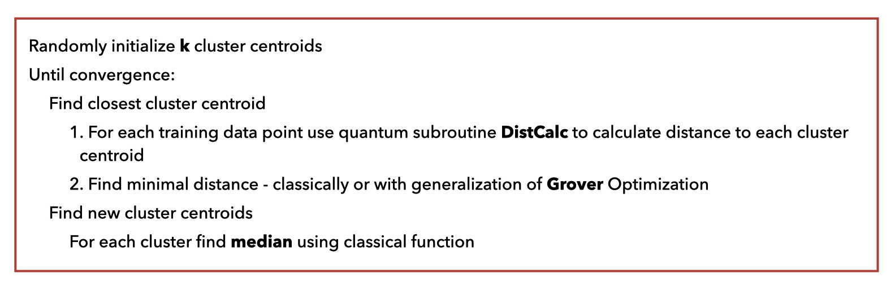
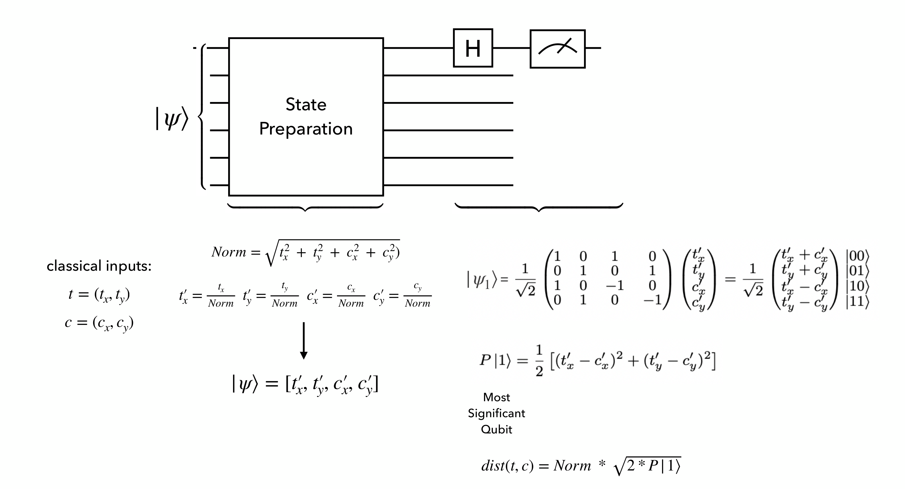

# Quantum k-medians clustering

Implementation of QKmedians from the paper: [2301.10780](https://arxiv.org/abs/2301.10780).

## Algorithm's pseudocode



## Distance calculation quantum circuit



## How to run an example?

### Download dataset
Dataset used in the paper above can be downloaded from `Zenodo` : 
[record/7673769](https://zenodo.org/record/7673769)

### Run training
To run a training of quantum k-medians algorithm we need to provide arguments:
- `train_size` (int): number of samples for training
- `read_file` (str): path to training dataset
- `device_name` (str): name of device for running quantum circuit simulation
- `seed` (int): seed for consistent results in training
- `k` (int): number of clusters
- `tolerance` (float): convergence tolerance
- `save_dir` (str): path to save results

```python
python train_qkmedians.py --train_size 600 --read_file '/data/training_dataset.h5' --k 2 --device_name '/GPU:0' --seed 123 --tolerance 1e-3 --save_dir 'save_directory'
```